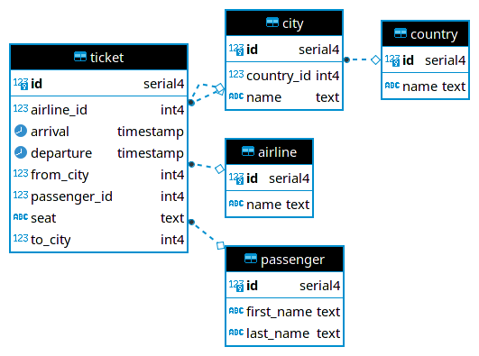
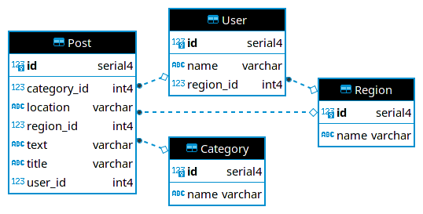

# air_traffic

The Ticket fact table is characterized by `passenger_id`, `from_city_id`, `to_city_id`, and `airline_id` foreign keys to respective dimension tables. The City dimension is further denormalized with a Country dimension, in a snowflake fashion.

# craigslist

The Post fact table is characterized by `user_id`, `region_id`, and `category_id` foreign keys to respective dimension tables. The Region dimension is also used as an outrigger for the User dimension.

# medical_center

Each Doctor belongs to one Hospital.

The many-to-many relationship between Doctor and Patient is captured by the DoctorPatient juntion table.

The Visit fact table is characterized by `doctor_id` and `patient_id` foreign keys, along with the date.

The Diagnosis fact table is characterized by `disease_id`, `patient_id`, and `visit_id` foreign keys. `visit_id` can be used to join to the Visit (and therefore the date) that a diagnosis was made, capturing the one-to-many relationship between Visit and Diagnosis. `patient_id` can be used to pull in all the diagnoses that have been made for a patient, capturing the many-to-many relationship between Disease and Patient.

# music

Each Song belongs to a single Album.

Song has a many-to-many relationship with both Producer and Artist, captured by the ProducerSong and ArtistSong junction tables.

# outer_space

A series of many-to-one relationships. Each Moon belongs to a Planet which belongs to a Star which belongs to a Galaxy.

# soccer

Each Player belongs to a team. Because players can move between teams, this is a slowly changing dimension captured with a `from_date` and `to_date` field.

There is a many-to-many relationship between Referee and Match captured with the RefereeMatch junction table

The Match table also has a many-to-one relationship with Season.

The Goal fact table is characterized by `match_id` and `player_id` foreign keys.

A separate Outcome table is maintained to simplify the task of computing standings. While the Match table links only the away team, home team, and season with one row for each match, the Outcome table's grain is match x team.

